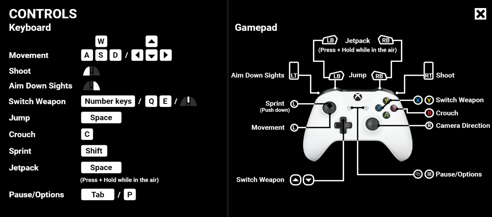
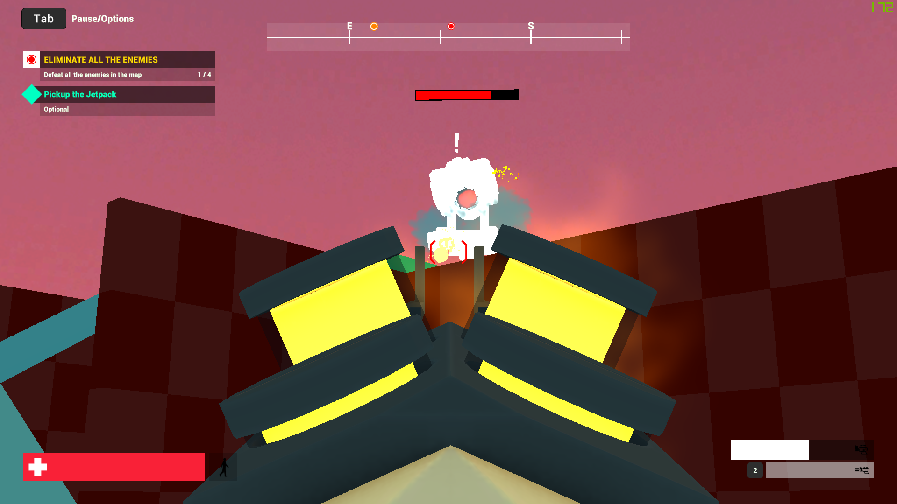
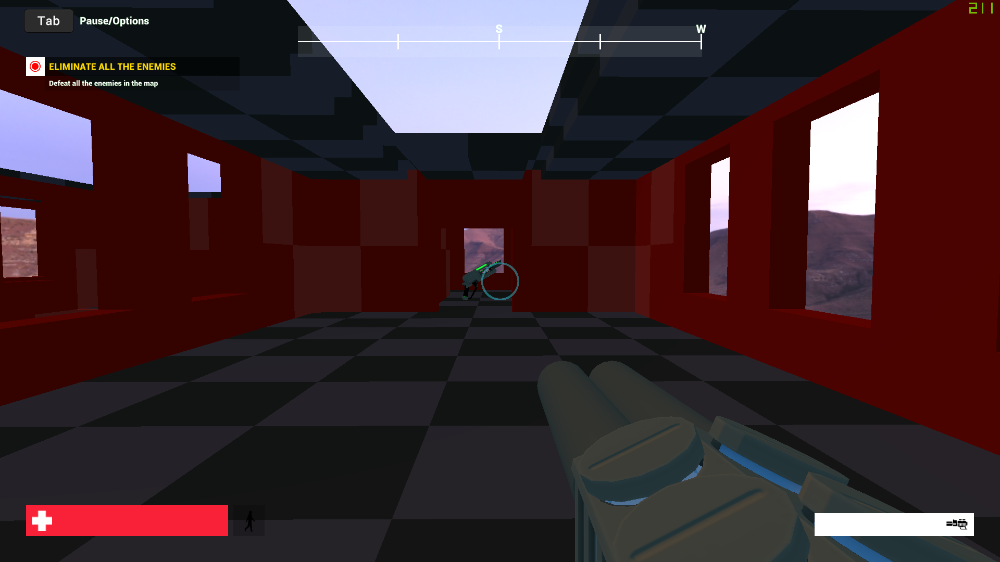

# FPS Minigame
This is a FPS game created using Unity3D and C# 

## Abstract 
It has been found in researches that there is an association between playing first-person
shooter video games and having superior mental flexibility. It was found that people playing
such games require a significantly shorter reaction time for switching between complex tasks,
mainly because when playing fps games, they require to rapidly react to fast moving visuals
by developing a more responsive mind set and to shift back and forth between different sub-
duties.

The successful design of the FPS Minigame with correct direction, attractive graphics and models
will give the best experience to play the game. The main design element of this type of games is combat and action centered. This game
comes also comes under role player category too, because player has to play with protagonist point of view.

The game consists of two levels. The controls of the game are mentioned below.

## Contents in the folder
1. A game executable file by the name of **FPS Minigame**. Located in the **Builds** folder.
2. The C# scripts used in making the game. Located in the **Scripts** folder.

## How to launch the game?
1. Download the entire repo.
2. Navigate to the **FPS Minigame.exe** file present in the **Builds** folder.
3. While launching the game you'll have an option to customize your game settings. You can adjust the settings as for your own comfort or you can play with the preffered settings. Click **Play!** to launch the game.

## System specs used in the development of the game
1. Windows 10
2. Shader Model 2.0
3. Core i5 8th gen 2.2Ghz
4. 8 GB RAM
5. GTX 1050ti graphic card

## Hardware required for running the game
1. Windows 7 or later
2. Processor Core2duo 2.2GHz or Higher
3. 2 GB RAM or higher
4. Free space 5GB or more
5. Graphic card 1GB or higher

## Controls

## In-Game Screenshots

### Level-1

### Level-2

## Made by
Ankit Kumar

## Refrences
- [Code Monkey](https://www.youtube.com/channel/UCFK6NCbuCIVzA6Yj1G_ZqCg)
- [Roman Papush](https://www.youtube.com/user/RamzesII)
- [CouchFerret makes Games](https://www.youtube.com/channel/UCp5WDvPDLCkSZWp9hP5xIvQ)
